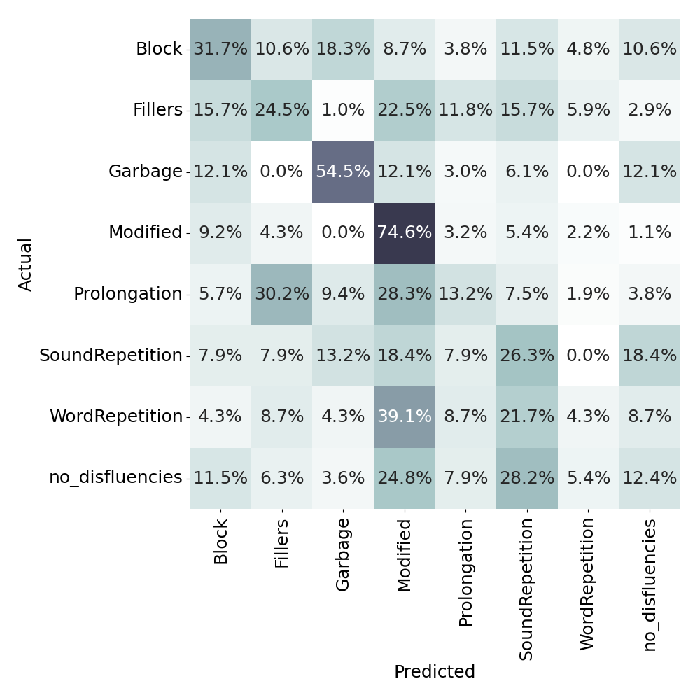

# ComParE22 - Kassel State of Fluency Challenge (KSF-C)
This repository provides the code for running the official baselines for the Stuttering subchallenge of ComParE22.

## Getting the code
Clone this repository together with its submodules and checkout the correct branch:
```bash
git clone --recurse-submodules --branch KSF-C https://github.com/EIHW/ComParE2022
```

## Installation
To install the baseline's dependencies, you can either use the nix package manager (which we used in development) or a traditional python+virtualenv setup.

### Nix
If you have nix with flakes support installed on your Linux system, run:
```bash
nix develop path:.envs/default
```
Then you are good to go.

### Python virtual environment
Create a new virtual environment with python3.7 installed and activate it, e.g. with conda:
```bash
conda create -n ComParE22 python=3.7
conda activate ComParE22
```
Then install the requirements:
```bash
pip install -r requirements.txt
```

Download and unpack the binary release of opensmile:
```bash
wget https://github.com/audeering/opensmile/releases/download/v3.0.1/opensmile-3.0.1-linux-x64.tar.xz
tar -xf opensmile-3.0.1-linux-x64.tar.xz
```


## Reproducing the results
Copy the contents of the challenge package to `./dist`. The folder structure should look like this:
```bash
.
├── dist
│   ├── features
│   ├── lab
│   └── wav
.
```
You can now either choose to reproduce the whole pipeline (including feature extraction) or only the SVM classification. If you want to skip feature extraction, run 
```bash
dvc commit features
```
and confirm everything with `y`.

In either way, now execute
```bash
dvc repro
```


## Results

| System                                | Development | Test       |
|---------------------------------------|-------------|------------|
| opensmile                             | 30.2        | 37.6       |
| deepspectrum                          | 28.1        | 40.4       |
| audeep                                | 17.7        | 25.9       |
| xbow                                  | 26.7        | 32.1       |
| fusion                                | 28.7        | 38.3       |

### CM for best result on development partition:



## Citation

If you use the code from this repository, you are kindly asked to cite the following paper.

> Björn W. Schuller, Anton Batliner, Shahin Amiriparian, Christian Bergler, Maurice Gerczuk, Natalie Holz, Sebastian Bayerl, Korbinian Riedhammer, Adria Mallol-Ragolta, Maria Pateraki, Harry Coppock, Ivan Kiskin, Stephen Roberts, "The ACM Multimedia 2022 Computational Paralinguistics Challenge: Vocalisations, Stuttering, Activity, & Mosquitos," in *Proceedings of 30th International Conference on Multimedia*, (Lisbon, Portugal), ACM, 2022.

```
@inproceedings{Schuller22-TAM,
  author = {Bj\”orn W.\ Schuller and Anton Batliner and Shahin Amiriparian and Christian Bergler and Maurice Gerczuk and Natalie Holz and Sebastian Bayerl and Korbinian Riedhammer and Adria Mallol-Ragolta and Maria Pateraki and Harry Coppock and Ivan Kiskin and Stephen Roberts},
  title = {{The ACM Multimedia 2022 Computational Paralinguistics Challenge: Vocalisations, Stuttering, Activity, \& Mosquitos}},
  booktitle = {{Proceedings of 30th International Conference on Multimedia}},
  year = {2022},
  address = {Lisbon, Portugal},
  publisher = {ACM},
  month = {October},
  note = {to appear},
}
```
