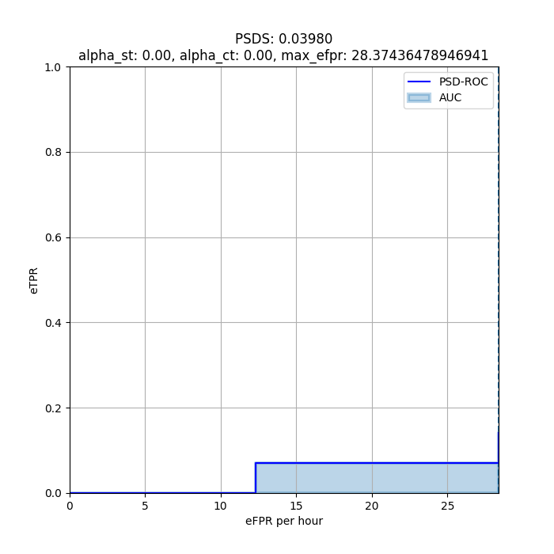

# Baseline reproduction
This branch contains all the code to reproduce end-to-end, feature extraction, model training, model development evaluation, and running code over dev data. 

Please note, this baseline is heavily based on [HumBugDB](https://github.com/HumBug-Mosquito/HumBugDB), where you will find a range of similar models and feature extraction methods for inspiration to outperform the baseline supplied here. The methods, and data are heavily documented in our [NeurIPS 2021 paper](https://arxiv.org/abs/2110.07607v1).
### Structure
* `config.py`: configuration of paths, model objects, feature parameters, etc.
* `config_keras.py`: configuration of deep learning params
* `evaluate.py`: utilities for model evluation
* `feat_util.py`: utilities for model training and dev evaluation
* `util.py`: Utilities for `predict.py`
* `mozzbnn_model.py`: Re-creation of CNN architecture.
* `data/metadata`: Metadata, from which data is partitioned and labels are extracted.
* `data/audio`: Location of audio data.
* `data/labels/dev`: Labels for `dev`, supplied in the same format as in the hidden test data.
* `data/predictions/dev`: Predictions for `dev` with the supplied baseline, to match the syntax as used in the labels.

### How to run
* Extract data from [Zenodo](https://zenodo.org/record/6478589) to `/data/audio`.
*   ```
    python run_baseline.py
    ```
* A jupyter notebook with identical functionality is supplied in `notebooks/main.ipynb`.

#### Options for `run_baseline.py` set in `config.py`:
* `retrain_model`: Start model training from scratch
* `predict_dev`: Whether to predict over `dev` data.
* `extra_eval`: Return extra evaluation metrics per feature window: note, the results here are dependent on feature window sizes. By default, this will return metrics evaluated over 1.92 second segments, with samples that do not divide into the data evenly discarded. 
* `predict_test`: Predict over `/data/test`. You may place your own files here for the purpose of debugging, but remove before submission.

### Written outputs
The expected outputs, as defaulted in `config.py` are:
* `data/features/MED`: outputs of features extracted in `get_train_test_from_df`
* `data/plots`: diagnostic plots with extra information to ease model development.
* `models/keras`: Location of saved model objects/weights
* On-screen figure outputs:
    * if `predict_dev`: PSDS, TPR vs FPR graphs for `dev` (time-domain scoring)
    * if `extra_eval`: Raw classifier output per feature, segment-based (feature-domain scoring) ROC, confusion matrix, and PR curves for `dev`


## Data 
The data is documented in depth in our [NeurIPS 2021 paper](https://arxiv.org/abs/2110.07607v1), with a snapshot of useful metadata given in `data/metadata`. The interested user may consult each individual experiment that provides data, and cross-reference with the metadata supplied, to for-example sub-select or augment certain sources of data and/or weight their importance unequally. Please note, that the `dev` data for this task consists of `Test A` and `Test B` from HumBugDB, with the addition of challenging negatives to `Test A`. The results are therefore strongly correlated, but not identical in this challenge. The `train` data is identical. The difference of data/metadata can be seen by comparing the revision [0.0.1](https://zenodo.org/record/4904800) and [0.0.2](https://zenodo.org/record/6478589) on Zenodo.  To reproduce the _metrics_ of that paper, run `run_baseline.py` with `extra_eval` set to `True`, or run the appropriate cells in the Jupyter notebook.

## Baseline model

The baseline model is supplied in `mozzbnn_model.py`, features a CNN with four convolutional, two max-pooling, and one fully connected layer augmented with dropout layers (shown in [Appendix B.4, Figure 3 of HumBugDB](https://arxiv.org/pdf/2110.07607.pdf)). Its structure is based on prior models that have been successful in assisting domain experts in curating parts of this dataset with uncertainty metrics [Automatic Acoustic Mosquito Tagging](https://link.springer.com/chapter/10.1007/978-3-030-86514-6_22).

## Scoring function
1. This challenge will use a primary metric of PSDS: the [Polyphonic Sound Event Detection Score](https://github.com/audioanalytic/psds_eval). Essentially, the score is a generalisation of the event-based F-score. We calculate the area under the ROC curve for event-based detections to provide a metric that is independent of classifier threshold. **The area will be evaluated from 10 thresholds** `[0.1, 0.2, ..., 1.0]`.
2. The secondary score will be the maximum event-based F-score of any of the supplied thresholds `[0.1, ..., 1.0]`.


The format of the predictions has to conform to the format as given in `data/predictions/dev/a/baseline_{}.csv`, with the columns `onset`, `offset`, `event_label`, in a tab-delimited `csv`. An example is given below for `206567.wav`. For further information consult the [README of psds_eval](https://github.com/audioanalytic/psds_eval). Please note that the `filename` field does not include the file extension.

| filename | onset | offset | event_label |
|----------|-------|--------|-------------|
| 206567   | 0.0   | 1.56   | mosquito    |

## Baseline results
Model: `Win_30_Stride_10_2022_04_27_18_45_11-e01val_accuracy0.9798.hdf5`

Please note that PSD-score and Max F1 are evaluated in the time domain on an event-based scheme. The remaining metrics are only there for information purposes, to aid in the development, and **are not used for the scoring of this challenge**, as they are generated per feature window of the model, which is dependent on the size of the feature window. Upon reproduction, due to the stochastic nature of the BNN, there will be slight variability over the outputs.

| Dataset | PSD-score | Max F1 | ROC-AUC | PR-AUC | TP    | FP    | TN    | FN    |
|---------|-----------|--------|---------|--------|-------|-------|-------|-------|
| dev A   | 0.61429   | 0.7246 | 0.908   | 0.822  | 67.5% | 7.11% | 92.9% | 32.5% |
| dev B   | 0.03404   | 0.2075 | 0.509   | 0.416  | 3.0%  | 0.5%  | 99.5% | 97.0% |

**Dev A PSD-ROC:**
 

**Dev B PSD-ROC:**

